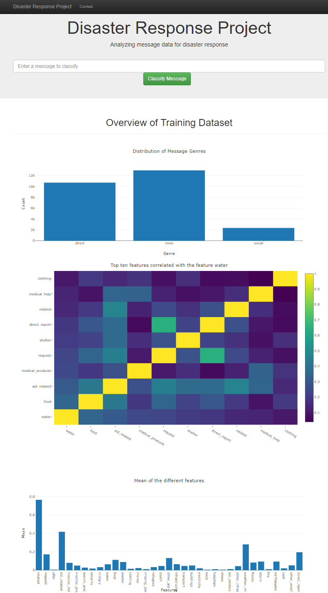
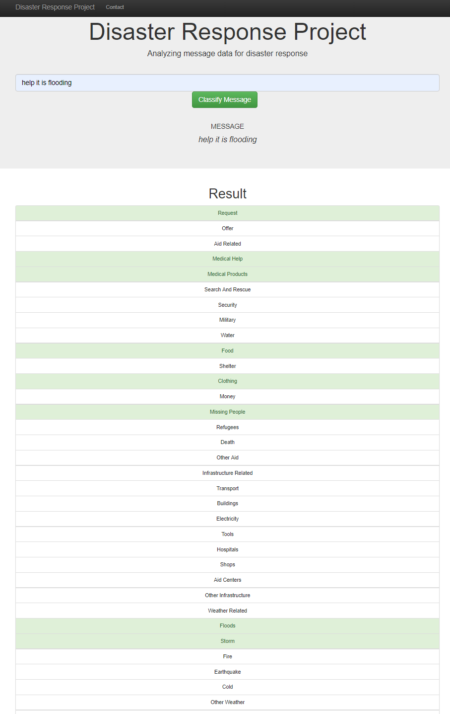

# DSND5: Disaster Response Pipeline Project



## Table of Contents
1. [Description](#description)
2. [Getting Started](#getting_started)
	1. [Dependencies](#dependencies)
	2. [Installing](#installing)
	3. [Executing Program](#executing)
	4. [Additional Material](#material)
3. [Authors](#authors)
4. [Acknowledgement](#acknowledgement)
5. [Screenshots](#screenshots)

<a name="descripton"></a>
## Description

This Project is part of Data Science Nanodegree Program by Udacity.  
Disaster data from [Figure Eight](https://www.figure-eight.com/) is used to build a NLP model for an API that classifies disaster messages. 

The Project is divided in the following Sections:

1. Data Processing, ETL Pipeline to extract data from source, clean data and save them in a proper databse structure
2. Machine Learning Pipeline to train a model able to classify text message in categories
3. Web App to show model results in real time. 

<a name="getting_started"></a>
## Getting Started

<a name="dependencies"></a>
### Dependencies
* Python 3.5+ 
* Machine Learning Libraries: NumPy, SciPy, Pandas, Sciki-Learn
* Natural Language Process Libraries: NLTK
* SQLlite Database Libraqries: SQLalchemy
* Web App and Data Visualization: Flask, Plotly

<a name="installing"></a>
### Installing
Clone this GIT repository:
```
https://github.com/PriceTT/DSND5.git
```
<a name="executing"></a>
### Executing Program:
1. Run the following commands in the project's root directory to set up your database and model.

    - To run ETL pipeline that cleans data and stores in database
        `python data/process_data.py data/disaster_messages.csv data/disaster_categories.csv data/DisasterResponse.db`
    - To run ML pipeline that trains classifier and saves
        `python models/train_classifier.py data/disasterMessages.db models/classifier.pkl`

2. Run the following command in the app's directory to run your web app.
    `python run.py`

3. Go to http://0.0.0.0:3001/

<a name="material"></a>
### Additional Material

In the **EDA_Jupyter_Notebook**  folder you can find two jupyter notebook that will help you understand how the model works step by step:
1. **ETL Preparation Notebook**: learn everything about the implemented ETL pipeline
2. **ML Pipeline Preparation Notebook**: look at the Machine Learning Pipeline developed with NLTK and Scikit-Learn

<a name="acknowledgement"></a>
## Acknowledgements

* [Udacity](https://www.udacity.com/) for  the starter template
* [Figure Eight](https://www.figure-eight.com/) for providing messages dataset 

<a name="screenshots"></a>
## Screenshots

1. This is an example of a message you can type to test Machine Learning model performance



